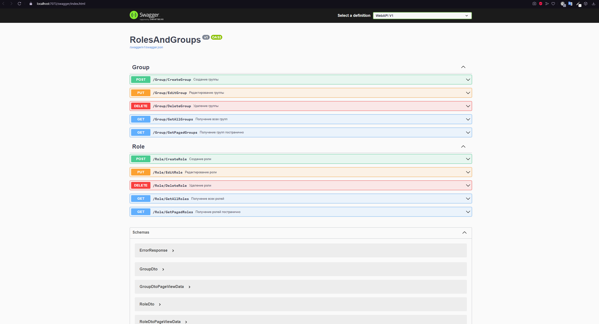
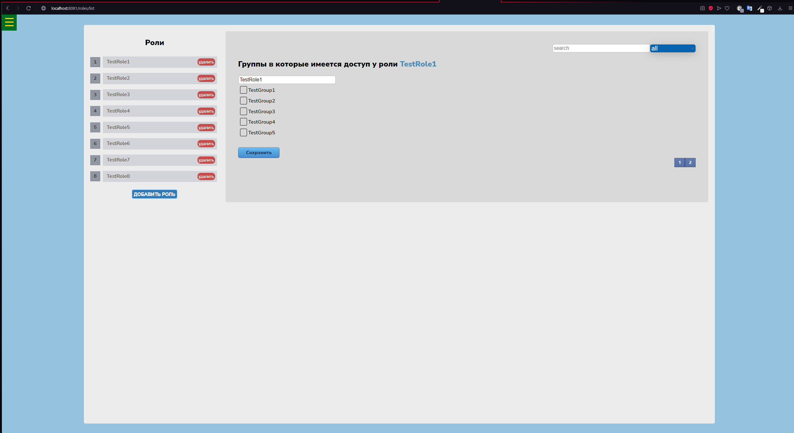
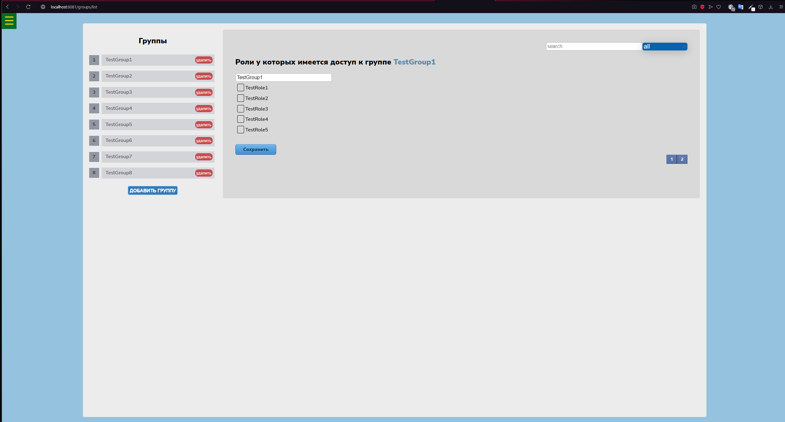
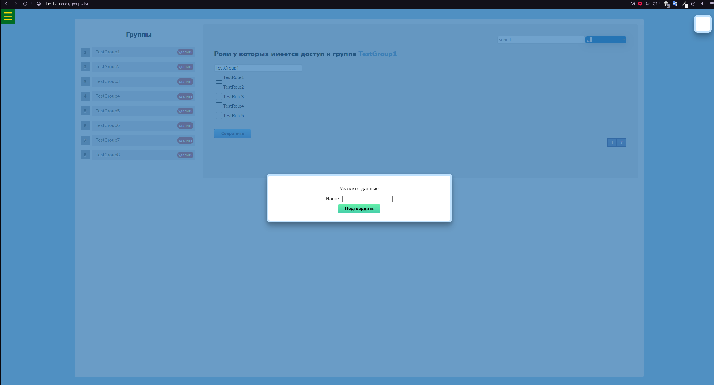

# Roles and Groups

Fullstack project with Angular and C#. Adaptive layout on pure CSS without frameworks,
complete CRUD logic over roles and groups, Webpack, PostCSS, filtering, search and pagination.
A backend has been implemented. The project is tested and works right out of the box.
you should run the backlink with the migrations and pull the npm packets.

## Frontend

The front is written in Angular 14 and Webpack 5. There is routing and global error handling. 
To start the front, you only need to pull the NPM packets and execute the command  (npm run start-dev), the project will be built and launched on Webpack 5.

## Backend
To run, you should run a backend (WebApi) with migrations, a database will be created and will be initialized with test data.
The back is written in ASP.NET Core 6, with the use of EF CORE 6. MS SQL Server is used for the database.
Do not forget to specify the connection string in the appsettings or usersecrets files.

I have tested the project and it starts immediately without problems.

## Backend Screenshots

## Frontend Screenshots

Roles

Group

Create a group

